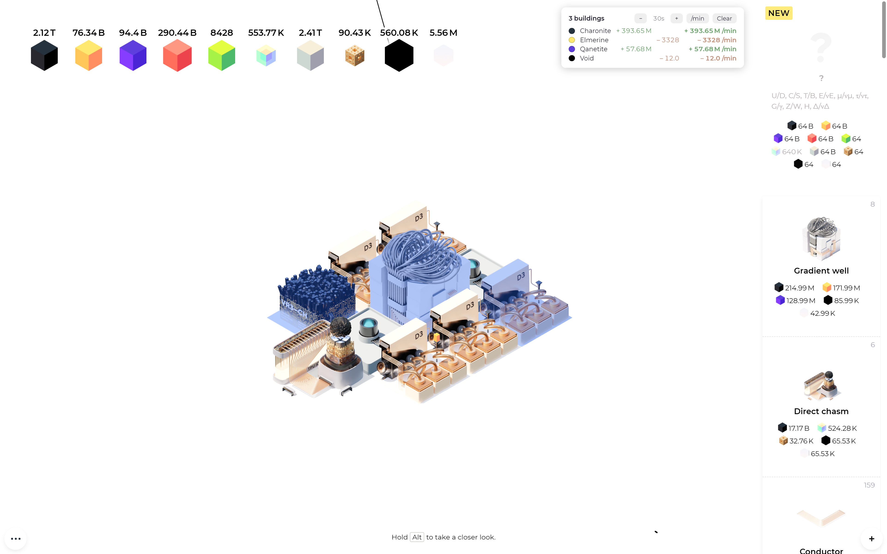

# Sixty Four Mods

Mods for [Sixty Four](https://store.steampowered.com/app/2659900/Sixty_Four/), built for the [Sixty Four Mod Loader](https://github.com/rafalberezin/sixty-four-mods).

## Resource Monitor

Multi-select buildings and watch the resources flowing in and out of the selection, averaged over a rolling window — see at a glance whether a build layout is actually profitable.



### Usage

- Press **R** (rebindable in mod settings) to toggle **select mode** — a badge appears at the bottom of the screen.
- **Click** a building to toggle it, or **hold and drag** to paint-select a group. The building you press first decides what the drag does: starting on an unselected building selects everything you sweep over, starting on a selected one deselects. Resource cubes are ignored.
- Press **R**, **Esc**, **Q**, or **E** to leave select mode. The stats panel stays open while anything is selected.
- The panel (top right, left of the shop) shows production (green), consumption (red), and net per resource. Click the **/min** button to switch between per-minute and per-second, and use **−**/**+** to adjust the averaging window (10s–10m).
- Selected storage machines (containment vessel / containment silo) get an extra row showing total stored Chromalit against capacity and the fill/drain rate.

Rates are measured live per building — fuel intake, production at emission, and chasm-network output (gradient well, general decay reactor) are all attributed to the building that caused them. Purchases, refunds, and internal transfers are excluded.

### Settings

Available in the mod loader's settings screen:

| Setting | Default | Description |
| --- | --- | --- |
| Select Mode Key | `r` | Single key that toggles select mode |
| Averaging Window | `60` | Starting window in seconds; adjustable in the panel at runtime |
| Selection Tint Color | `#2266ff55` | RGBA hex color for the tint of selected buildings (last two digits = opacity) |

### Known limits

- Resource cubes are not selectable (they are transient), so income from manually breaking cubes is not measurable — machine-routed income (consumers, stabilizers, converters, chasm buildings) attributes correctly.
- Rare event payouts originate from HUD coordinates and may occasionally be attributed to a building that happens to sit at that spot.

## Installation

1. Install the [Sixty Four Mod Loader](https://github.com/rafalberezin/sixty-four-mods).
2. Copy the mod file(s) from [`mods/`](mods/) into the `mods/` folder in your game directory, e.g.:

   ```
   C:\Program Files (x86)\Steam\steamapps\common\Sixty Four\mods\
   ```

3. Launch the game. Mods can be enabled/disabled and configured from the mod loader's splash-screen settings.

Game version: 1.2.1 · Mod loader: 1.0.0+
